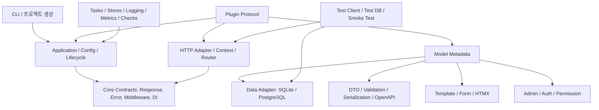

# Nim 풀스택 웹 프레임워크 구현 계획

### 2026-08-04 — P0 executor lifecycle/GC 안정화

- [x] taskpool job registry에서 GC 관리 `Table/seq`를 shared memory에 저장하지 않고 raw slot registry로 분리했다.
- [x] job closure의 명시적 GC root 해제를 worker thread가 아닌 event-loop의 Flowvar 완료 이후로 제한했다.
- [x] executor backend를 실제 sync 작업 시점에 lazy 초기화하고 반복 application lifecycle 회귀 테스트를 추가했다.
- [ ] taskpools backend가 보장하는 실제 worker 강제 cancellation adapter는 여전히 안전성 검토가 필요하다.

상태: 진행 전  
작성일: 2026-08-04  
기준 문서: [풀스택 Nim 웹 프레임워크 기능 요구사항](nim-fullstack-framework-requirements.md)

> 체크박스 규칙: `[ ]` 미착수, `[-]` 진행 중, `[x]` 완료. 항목을 완료하려면 구현·테스트·문서를 함께 반영한다.

## 진행 기록

### 2026-08-04 — P0 기반 수직 슬라이스 1차

- [x] Nim manifest와 public package entry point를 추가했다.
- [x] `Request`, `Response`, `Handler`, `Middleware`, `Route` 핵심 계약을 추가했다.
- [x] exact route와 `:namedParameter` route를 구현했다.
- [x] global/route middleware composition과 startup/shutdown hook을 구현했다.
- [x] 환경변수 기반 개발 설정(`MAHANAIM_ENV`, `MAHANAIM_DEBUG`, `MAHANAIM_HOST`, `MAHANAIM_PORT`)을 구현했다.
- [x] `tests/test_core.nim`에 core contract test 7개를 작성했고 모두 통과했다.
- [x] CLI `check`/`dev`를 컴파일하고 실행 검증했다.
- [ ] 실제 Prologue HTTP adapter, JSON/TOML 설정, CI는 다음 작업으로 남아 있다.

### 2026-08-04 — P0 기반 수직 슬라이스 2차

- [x] 표준 async HTTP network adapter를 추가하고 core `Request`/`Response`와 연결했다.
- [x] loopback HTTP smoke test로 실제 TCP 요청과 응답을 검증했다.
- [x] `new NAME [PATH]` 프로젝트 생성 CLI를 추가했다.
- [x] 생성 프로젝트의 파일 구성과 기존 파일 덮어쓰기 방지를 테스트했다.
- [ ] Prologue 전용 adapter, typed extraction, JSON/TOML 설정, CI는 남아 있다.

### 2026-08-04 — P0 API 검증 1차

- [x] 명시적 `FieldSpec` schema와 path/query/header/body 입력 위치를 추가했다.
- [x] 문자열·정수 coercion, 기본값, 길이·범위 제약, 다중 오류 수집을 구현했다.
- [x] `application/problem+json` 응답과 field-level 오류 envelope을 추가했다.
- [x] API 검증·오류 응답 테스트 3개를 추가했고 전체 테스트가 통과했다.
- [ ] macro 기반 schema 생성과 일반 응답 타입별 content negotiation은 남아 있다.

### 2026-08-04 — P0 API 검증 2차

- [x] JSON object body의 named field extraction과 scalar coercion을 추가했다.
- [x] malformed JSON body를 body 위치의 `invalid_json` 오류로 보고한다.
- [x] `Accept` 헤더에 따른 problem JSON/text 응답 선택을 추가했다.
- [x] JSON body와 content negotiation 테스트 3개를 추가했고 전체 테스트가 통과했다.
- [ ] stream/SSE/WebSocket representation의 통합 content negotiation은 남아 있다.

### 2026-08-04 — P0 response representations

- [x] buffered, stream, SSE, WebSocket representation metadata를 core Response에 추가했다.
- [x] SSE event framing과 stream/WebSocket response helper contract 회귀 테스트를 추가했다.
- [x] 표준 HTTP adapter에서 SSE representation framing을 실제 TCP wire로 검증했다.
- [x] 표준 network adapter의 close 중 serve cancellation을 graceful shutdown으로 정리했다.
- [x] 표준 TCP adapter의 stream/SSE 응답을 실제 chunked transfer wire로 연결했다.
- [x] 표준 TCP adapter의 WebSocket upgrade와 기본 frame wire를 연결했다.
- [x] 표준 HTTP·Windows Prologue adapter의 단일 response `Accept` negotiation과 406 정책을 연결했다.
- [x] 표준 HTTP adapter에서 buffered/stream/SSE representation variant를 `Accept` 기준으로 wire 선택했다.
- [x] Windows Prologue live fixture에서 variant 선택과 WebSocket upgrade `Accept` bypass를 검증했다.
- [x] stdlib와 Beast/httpx native socket을 공통 WebSocket byte transport와 session contract로 연결했다.
- [ ] Beast backend의 실제 live fixture와 backend 공통 WebSocket representation policy는 남아 있다.

### 2026-08-04 — P0 HTTP 응답 정책 1차

- [x] JSON response constructor와 `Set-Cookie` helper를 core contract에 추가했다.
- [x] HTML/JSON/text representation 선택과 미지원 media type의 406 응답을 구현했다.
- [x] representation 선택과 cookie 보안 속성 테스트를 추가했다.

### 2026-08-04 — P0 실행 경계 1차

- [x] `SyncHandler`와 `asyncHandler` adapter를 추가했다.
- [x] `getSync`/`postSync` 명시 등록 API를 추가했다.
- [x] sync handler가 공통 async dispatcher에서 동작하는 contract test를 추가했다.
- [x] 기본 thread-pool executor와 비차단 Future bridge를 추가했다.
- [x] worker 예외 복원·sync route offload·실패 전파 회귀 테스트를 추가했다.
- [x] `AppConfig.requestTimeoutMs`와 환경변수 provider를 추가하고 dispatch timeout을 504로 변환했다.
- [x] Nim의 비선점 실행 모델에 맞춘 cooperative cancellation token과 회귀 테스트를 추가했다.
- [x] deprecated `std/concurrency/threadpool`을 lockfile 기반 `taskpools` backend로 교체했다.
- [x] GC-managed `Response`를 worker에서 copy-safe shared buffer로 변환하고 event loop에서 복원했다.
- [x] 실행 중 cooperative cancellation 신호를 atomic token으로 전달하고 worker 안전 지점 종료를 검증했다.
- [x] blocking 감지 threshold, atomic cancellation escalation, backend cancellation hook과 pre-flight 검사를 추가했다.
- [ ] taskpools worker를 안전하게 중단하는 실제 backend 강제 cancellation 구현은 남아 있다.

### 2026-08-04 — P0 설정 provider 1차

- [x] `.env`, JSON, TOML flat key/value, process environment provider를 추가했다.
- [x] provider 병합 순서를 정의하고 process environment가 최종 우선하도록 했다.
- [x] secret store와 `redactSecrets`를 추가해 로그·오류 출력 전 비밀값 치환을 지원한다.
- [x] 설정 병합·TOML secrets section·redaction 테스트 2개를 추가했다.
- [ ] 완전한 TOML 문법, JSON/TOML schema validation, CI 재현 설치는 남아 있다.

### 2026-08-04 — P0 application extension 1차

- [x] application-level custom error handler와 안전한 기본 500 handler를 추가했다.
- [x] plugin registration API를 추가하고 plugin이 route를 등록하는 contract test를 추가했다.
- [x] 예외 상세가 기본 응답에 노출되지 않는지 검증했다.
- [ ] plugin manifest, DI provider, command/admin extension point와 redacted error logging은 남아 있다.

### 2026-08-04 — P0 보안 기본값 1차

- [x] secure response headers를 기본 middleware로 적용했다.
- [x] 설정된 allowed host 검증과 400 거부 응답을 추가했다.
- [x] route·404·405 fallback에도 동일 보안 middleware가 적용되도록 dispatcher를 정리했다.
- [x] middleware closure composition 자기 재귀 회귀를 수정하고 보안 회귀 테스트를 추가했다.
- [ ] clickjacking 세부 정책, rate limit, timeout policy는 남아 있다.

### 2026-08-04 — P0 보안 기본값 2차

- [x] exact-origin CORS allow list와 response headers를 추가했다.
- [x] CORS preflight `OPTIONS` 204 응답을 추가했다.
- [x] request body size limit과 413 응답을 추가했다.
- [x] CORS 허용·거부·preflight·oversized body 회귀 테스트를 추가했다.
- [ ] 기본 활성화 정책, rate limit, timeout policy는 남아 있다.

### 2026-08-04 — P0 보안 기본값 3차

- [x] HMAC-SHA256 signed CSRF token과 보안 난수 nonce 생성을 추가했다.
- [x] safe method 응답의 CSRF cookie 발급과 변경 method의 cookie/header 검증을 추가했다.
- [x] constant-time signature 비교와 위조·누락 토큰 회귀 테스트를 추가했다.
- [ ] 기본 활성화 정책, signed auth cookie rotation과 rate limit은 남아 있다.

### 2026-08-04 — P0 보안 기본값 4차

- [x] CSRF와 독립적으로 재사용 가능한 HMAC signed value·signed cookie API를 추가했다.
- [x] signed cookie의 HttpOnly·Secure 기본값과 secret 누락·위조 검증을 테스트했다.
- [x] Nimble test task가 lockfile dependency path를 명시해 CI와 로컬 실행을 일치시킨다.
- [ ] signed auth cookie rotation과 rate limit은 남아 있다.

### 2026-08-04 — P0 session binding 1차

- [x] `SessionPolicy`와 `AuthContext`를 추가해 signed session cookie의 subject를 공통 `Request`에 바인딩했다.
- [x] `requireAuthentication` 정책을 추가해 인증되지 않은 route 요청을 401로 거부한다.
- [x] session cookie 발급·삭제 helper와 secure cookie 속성, secret/cookie-name pre-flight 검사를 추가했다.
- [x] 유효·위조·누락 session, 인증 route, cookie lifecycle 회귀 테스트를 추가했다.
- [ ] 분산 session 저장소, session rotation/탈취 대응, 일반 auth backend 연동은 남아 있다.

### 2026-08-04 — P0 라우팅 기반 1차

- [x] route name registry와 중복 이름 검증을 추가했다.
- [x] typed parameter(`int`, `uint`, `float`, `bool`)와 trailing wildcard를 추가했다.
- [x] route group prefix·middleware와 named URL builder를 추가했다.
- [x] 정적 경로 우선순위와 동일 path의 HTTP method dispatch 회귀를 고정했다.
- [ ] radix/tree 기반 매칭 최적화, wildcard 인코딩 정책, Prologue adapter 연동은 남아 있다.

### 2026-08-04 — P0 pre-flight check 1차

- [x] config·route·security를 공통 `CheckReport` 계약으로 검사하도록 추가했다.
- [x] CLI `check`와 `dev`가 동일한 검사 결과를 사용하고 오류 시 non-zero로 종료하도록 변경했다.
- [x] 정상 설정과 invalid port·중복 route·약한 CSRF secret 실패 회귀 테스트를 추가했다.
- [ ] model·migration 검사와 CI/deployment 환경의 동일한 실행 wiring은 남아 있다.

### 2026-08-04 — P0 model metadata 1차

- [x] field, index, constraint, relation을 표현하는 backend-neutral metadata를 추가했다.
- [x] application-owned model registry와 중복 선언 방지를 추가했다.
- [x] check report가 model field·index·relation 참조를 검증하도록 연결했다.
- [x] metadata lookup과 registry·invalid reference 회귀 테스트를 추가했다.
- [ ] model macro 생성, query/backend adapter, migration compiler와 serializer/form/admin/OpenAPI 소비자는 남아 있다.

### 2026-08-04 — P0 model serializer 1차

- [x] metadata의 JSON rename·nullable·sensitive policy를 읽는 serializer를 추가했다.
- [x] string·integer·float·boolean·JSON boundary type 검증을 추가했다.
- [x] unknown field 정책과 구조화된 serialization issue를 추가했다.
- [x] 민감 필드 제외·null 처리·잘못된 타입 회귀 테스트를 추가했다.
- [x] 공통 serializer 경계에서 patch와 명시적 response projection을 추가했다.
- [x] registry 기반 `nestedModel` metadata와 재귀 DTO serialization을 추가했다.
- [ ] MessagePack adapter는 남아 있다.

### 2026-08-04 — P1 serializer adapter 1차

- [x] serializer API에 기존 호출을 깨지 않는 `SerializationAdapter` 확장점을 추가했다.
- [x] 표준 adapter가 UTC RFC3339 DateTime과 canonical UUID를 정규화하도록 구현했다.
- [x] file metadata의 필수 키·타입·음수 크기를 검증하고 nested DTO 경계에도 adapter를 전달한다.
- [x] DateTime·UUID·file metadata 성공/실패 회귀 테스트와 전체 `nimble test`를 통과했다.
- [ ] MessagePack wire adapter와 외부 파일 저장소/서명 URL 정책은 남아 있다.

### 2026-08-04 — P1 database contract 1차

- [x] SQLite/PostgreSQL 공통 dialect, parameterized select query, filter/order/pagination 계약을 추가했다.
- [x] identifier whitelist/quoting과 SQLite `?`·PostgreSQL `$n` placeholder를 테스트했다.
- [x] migration operation/compiler와 DatabaseAdapter의 begin/commit/rollback/execute 경계를 추가했다.
- [x] query binding·unsafe identifier 거부·index migration SQL 회귀 테스트와 전체 `nimble test`를 통과했다.
- [x] transaction guard가 성공 시 commit, 예외 시 rollback을 보장하고 savepoint 미지원 상태를 명시적으로 반환한다.
- [x] fake adapter의 commit/rollback 회귀 테스트와 전체 `nimble test`를 통과했다.
- [x] 공식 `db_connector` 기반 SQLite adapter의 bound execute, transaction, savepoint, migration up 실행을 추가했다.
- [x] SQLite CRUD·rollback·savepoint·migration 회귀 테스트와 전체 `nimble test`를 통과했다.
- [x] SQLite migration history, pending migration skip, latest down rollback을 추가하고 회귀 테스트를 통과했다.
- [x] backend-neutral one-hop relation JOIN AST/compiler와 SQLite/PostgreSQL placeholder 회귀 테스트를 추가했다.
- [-] PostgreSQL libpq adapter와 compile gate, 환경 기반 `postgres_testing` rollback fixture factory, backend-neutral bounded connection pool/request session wiring, backend capability/isolation contract를 추가했다. SCRAM credentials가 필요한 live integration/isolation 실행과 repository route 연결은 남아 있다.

### 2026-08-04 — P1 SQLite driver adapter 1차

- [x] `db_connector` dependency와 lockfile을 추가하고 `SqliteDatabaseAdapter`를 공개했다.
- [x] compiled query parameter를 SQLite prepared statement에 타입별로 bind하고 결과를 neutral row contract로 변환한다.
- [x] transaction, savepoint, migration up 경계를 adapter에 연결하고 닫힌 connection을 명시적으로 거부한다.
- [x] SQLite migration history와 latest down rollback을 제공한다.
- [x] PostgreSQL libpq adapter가 extended query parameter binding, NULL transport, transaction/savepoint lifecycle을 제공한다.
- [x] backend-neutral connection pool이 factory/borrow/release/close와 capacity exhaustion을 보장한다.
- [-] Application dispatch가 request-scoped adapter를 borrow/release하고 shutdown 시 pool을 닫는다. PostgreSQL typed result metadata와 live server fixture는 남아 있다.
- [x] DatabaseSession이 borrowed connection의 begin/commit/rollback/release unit-of-work를 보장하고 SQLite 회귀 테스트를 통과했다.
- [x] metadata-driven repository가 relation metadata와 target metadata로 one-hop JOIN execution을 수행하고 SQLite 통합 테스트를 통과했다.
- [x] SQLite/PostgreSQL capability matrix가 transaction/savepoint/typed NULL/isolation 지원 범위를 명시하고 unsupported isolation을 거부한다.

### 2026-08-04 — P1 API schema/OpenAPI 1차

- [x] explicit `FieldSpec`의 path/query/header/body 위치를 OpenAPI 3.1 parameter/requestBody로 투영했다.
- [x] string/integer 타입, required/default, length/numeric constraint를 OpenAPI schema에 반영했다.
- [x] 생성 문서의 위치·필수 필드·제약조건 회귀 테스트와 전체 `nimble test`를 통과했다.
- [x] explicit `FieldSpec` response schema를 OpenAPI 3.1 `200` JSON response에 투영했다.
- [-] 다중 operation registry와 Swagger/ReDoc UI route를 추가했다. schema macro, route 자동 수집과 완전한 content negotiation은 남아 있다.

### 2026-08-04 — P2 observability foundation 1차

- [x] application dispatch에 request ID 생성/검증과 response `X-Request-ID` 반영을 연결했다.
- [x] request/error/in-flight 기본 metrics와 구조화 `RequestEventSink` extension point를 추가했다.
- [x] lifecycle readiness 상태와 JSON health/readiness response를 추가했다.
- [x] supplied/invalid request ID, counter lifecycle, readiness 200/503 회귀 테스트와 전체 `nimble test`를 통과했다.
- [x] W3C `traceparent` 검증·전파와 response trace header를 추가했다.
- [x] JSON `StructuredLogSink`와 deterministic request log record를 추가하고 회귀 테스트를 통과했다.
- [ ] Logue/OpenTelemetry exporter와 production metrics exporter 연결은 남아 있다.

### 2026-08-04 — P1 MessagePack serializer 1차

- [x] JSON AST를 외부 dependency 없이 MessagePack scalar/array/map wire format으로 인코딩했다.
- [x] object key를 정렬해 동일 문서의 binary 결과를 결정적으로 만들었다.
- [x] invalid `SerializationResult`를 인코딩하지 않도록 validation boundary를 연결했다.
- [x] `application/msgpack` binary response helper를 추가해 유효한 serializer 결과를 HTTP 응답으로 반환한다.
- [x] map ordering과 invalid result 거부 회귀 테스트, 전체 `nimble test`를 통과했다.
- [ ] MessagePack decode/stream response content negotiation과 schema-level custom extension type은 남아 있다.

### 2026-08-04 — P1 form binding 1차

- [x] 기존 `FieldSpec`/`ValidationResult`를 재사용하는 `FormState` binding contract를 추가했다.
- [x] field value/error/required 상태를 HTML input context로 변환하고 attribute/text escaping을 적용했다.
- [x] CSRF enabled policy를 사용할 때 signed hidden input을 생성하도록 연결했다.
- [x] URL-encoded invalid input, escaped value, CSRF field 회귀 테스트와 전체 `nimble test`를 통과했다.
- [-] template inheritance/include/filter의 독립 엔진은 구현했다. i18n과 model formset은 남아 있다.

### 2026-08-04 — P1 API pagination contract 1차

- [x] query contract에 page/pageSize/maxPageSize와 deterministic SQL offset 계산을 추가했다.
- [x] 음수·0 page/size와 maximum 초과를 사전 거부하고 base query 복사 semantics를 유지했다.
- [x] page 3/size 10의 `LIMIT/OFFSET`와 invalid input 회귀 테스트, 전체 `nimble test`를 통과했다.
- [-] 공통 query component를 CRUD/admin list의 in-memory reference adapter까지 연결하고 QuerySet aggregate SQL compiler, repository JSON result mapping, explicit aggregate route adapter를 추가했다. cursor pagination과 count/total metadata는 남아 있다.

### 2026-08-04 — P2 plugin manifest 1차

- [x] version/name/dependency metadata와 middleware/routes/services 등 registration phase enum을 추가했다.
- [x] 기존 bare `Plugin` proc API를 유지하면서 manifest plugin overload를 제공했다.
- [x] manifest를 application에 기록하고 duplicate/invalid manifest를 설치 전에 거부한다.
- [x] phase 기록과 duplicate/name validation 회귀 테스트, 전체 `nimble test`를 통과했다.
- [x] dependency 누락·중복·순환을 검증하는 deterministic topological resolver를 추가했다.
- [x] dependency-first ordering과 invalid graph 회귀 테스트를 추가했다.
- [x] command registry와 admin installer extension point, duplicate registration 검증을 추가했다.
- [ ] command frontend integration, admin authorization/UI/audit와 DI lifecycle disposal은 남아 있다.

### 2026-08-04 — P1 CRUD resource 1차

- [x] `ResourceStore` persistence contract와 deterministic `InMemoryResourceStore` reference adapter를 추가했다.
- [x] metadata serializer를 재사용하는 list/get/create/update/delete response 경계를 추가했다.
- [x] create/update 입력에서 required/type/unknown-field 검증을 저장 전에 적용하고 auto-generated primary key 예외를 분리했다.
- [x] collection/detail route convention과 invalid body/404/204 semantics를 연결했다.
- [x] create/list/update/delete/invalid input 회귀 테스트와 전체 `nimble test`를 통과했다.
- [-] metadata-driven repository가 SQLite adapter에 CRUD, typed JSON conversion, bound filter와 QuerySet aggregate JSON mapping을 연결했다. PostgreSQL live repository, filtering/aggregate relation execution과 admin UI는 남아 있다.

### 2026-08-04 — P2 DI foundation 1차

- [x] application/request/task dependency scope와 typed marker service/provider contract를 추가했다.
- [x] application scope singleton cache와 request/task factory semantics를 구현했다.
- [x] Application wrapper와 plugin에서 사용할 수 있는 explicit provide/resolve API를 연결했다.
- [x] singleton identity, factory recreation, unknown/duplicate dependency 회귀 테스트와 전체 `nimble test`를 통과했다.
- [ ] request/task container ownership, dependency graph resolution, lifecycle disposal과 command/admin extension은 남아 있다.

### 2026-08-04 — P2 background job 1차

- [x] existing ThreadPoolExecutor를 재사용하는 `BackgroundJobQueue`와 job result contract를 추가했다.
- [x] max attempts/delay를 검증하고 retry를 event-loop sleep으로 bounded asynchronous scheduling한다.
- [x] 성공·실패 attempt count와 retry policy invalid input 회귀 테스트, 전체 `nimble test`를 통과했다.
- [ ] durable job persistence, idempotency key, crash recovery와 외부 queue adapter는 남아 있다.

### 2026-08-04 — P1 content negotiation 2차

- [x] Accept media type parameter에서 quality factor를 파싱하고 0..1 범위로 정규화했다.
- [x] quality 내림차순과 header order tie-break를 적용해 server variants를 선택한다.
- [x] `q=0`을 명시적 거부로 처리하고 기존 wildcard/406 정책을 보존하는 회귀 테스트를 통과했다.
- [x] reusable object response schema와 typed response OpenAPI projection을 추가했다.
- [-] Swagger/ReDoc UI와 수동 operation registry를 추가했다. route schema macro와 자동 operation 수집은 남아 있다.

### 2026-08-04 — P2 operations runbook

- [x] timeout/cancellation, executor overload, rate-limit fail-closed, background retry와 graceful shutdown 정책을 문서화했다.
- [x] request ID/health/readiness와 현재 미지원인 unsafe thread termination, external DB/queue drain 책임을 명시했다.
- [ ] distributed rate-limit clock/TTL/eviction, durable queue recovery와 external backend runbook은 adapter 구현 뒤 확장한다.

### 2026-08-04 — P1 model metadata macro 1차

- [x] Nim object field를 source order대로 읽어 backend-neutral `ModelMetadata`를 생성하는 macro를 추가했다.
- [x] string·integer·float·boolean·DateTime·UUID·JsonNode 타입 매핑을 명시적으로 고정했다.
- [x] 상속 object와 지원하지 않는 field type은 compile-time 오류로 거부한다.
- [x] 생성 metadata의 이름·table·field order·kind 회귀 테스트를 추가했다.
- [ ] relation/index/constraint annotation, Option·컬렉션·custom type adapter는 남아 있다.

### 2026-08-04 — P0 handler execution 1차

- [x] route에 async/sync execution metadata를 기록하도록 추가했다.
- [x] synchronous handler를 기본 check warning으로 노출하고 strict policy에서 거부하도록 추가했다.
- [x] sync handler가 비동기 wrapper 뒤에서 실행되는 기존 contract를 유지하면서 정책 회귀 테스트를 추가했다.
- [x] taskpools executor adapter와 blocking 감지·cancellation hook 운영 경계를 추가했다.
- [ ] backend별 자동 전환과 안전한 native worker 중단은 남아 있다.

### 2026-08-04 — P0 Prologue adapter 1차

- [x] Prologue 0.6.8 의존성을 추가하고 framework-neutral request 변환을 구현했다.
- [x] method·path·query·header·cookie·body와 response headers bridge를 추가했다.
- [x] Prologue mocking request 기반 adapter 회귀 테스트를 추가했다.
- [x] catch-all Prologue server bridge와 core startup/shutdown lifecycle wrapper를 추가했다.
- [x] mocking context에서 Prologue response와 core dispatcher integration을 검증했다.
- [x] Prologue raw form body와 `Content-Type`을 core body parser로 연결하는 contract test를 추가했다.
- [x] Prologue multipart upload body를 core parser/storage contract로 연결했다.
- [x] WebSocket frame kind와 adapter-owned session callback core contract를 추가했다.
- [x] Windows stdlib Prologue backend에 adapter-owned transport와 ephemeral-port/graceful-close live fixture를 추가했다.
- [ ] Beast backend의 WebSocket adapter와 backend별 socket ownership fixture는 남아 있다.

### 2026-08-04 — 표준 TCP chunked stream wire

- [x] `rrStream`과 `rrServerSentEvents` 응답을 `AsyncHttpServer.respond`의 buffered 경로와 분리했다.
- [x] 표준 TCP adapter가 `Transfer-Encoding: chunked`와 terminating zero chunk를 직접 작성한다.
- [x] 여러 chunk를 생성하는 live HTTP 회귀 테스트를 추가했다.
- [x] HTTP route와 분리된 `WebSocketRoute` registry와 path precedence 회귀 테스트를 추가했다.
- [x] 표준 TCP adapter의 RFC 6455 handshake, client masking, text frame echo, close lifecycle을 live socket으로 검증했다.
- [x] Windows Prologue native request bridge가 공통 WebSocket handshake/session adapter로 위임하도록 연결했다.
- [x] Windows Prologue bridge가 WebSocket/426 응답 뒤 Prologue central response를 중복 실행하지 않도록 handled 상태를 고정했다.
- [x] Windows stdlib Prologue backend의 실제 TCP 응답과 idempotent graceful close를 live fixture로 검증했다.
- [x] 최종 단일 response media type을 `Accept`와 비교해 불일치 시 406을 반환한다.
- [x] 표준 HTTP와 Windows Prologue bridge에 response policy를 연결하고 WebSocket upgrade는 이를 우회한다.
- [x] `responseVariants`가 buffered/stream/SSE 후보를 보존하고 표준 HTTP adapter가 실제 chunked wire로 선택한다.
- [x] Windows Prologue bridge가 JSON variant와 WebSocket echo를 실제 TCP wire에서 처리하고 `Accept`를 upgrade에 적용하지 않음을 검증했다.
- [x] stdlib AsyncSocket과 Beast/httpx SocketHandle을 공통 WebSocket byte transport로 분리하고 httpx `forget()` ownership handoff를 연결했다.
- [ ] Beast backend live fixture는 Linux target C runtime 환경에서 다음 slice로 검증한다.
- [ ] backend 공통 WebSocket representation policy와 Beast live fixture는 다음 P0 slice로 남긴다.

### 2026-08-04 — P0 Prologue socket fixture 상태 정정

- [x] Windows stdlib Prologue backend의 adapter-owned socket, 실제 TCP 응답, WebSocket echo, idempotent graceful close를 live fixture로 검증했다.
- [ ] Beast backend의 socket ownership과 Linux target C runtime live fixture는 별도 환경에서 검증해야 한다.

### 2026-08-04 — P0 실행 timeout/cancellation 1차

- [x] `AppConfig.requestTimeoutMs`와 환경변수 provider를 추가했다.
- [x] 공통 dispatch 경계에서 timeout을 감지하고 504 응답으로 변환한다.
- [x] Nim의 비선점 실행 모델에 맞춰 cooperative cancellation token과 회귀 테스트를 추가했다.
- [x] taskpools executor backend 교체와 blocking 감지 threshold를 연결했다.
- [ ] backend별 안전한 native worker 강제 cancellation은 남아 있다.

### 2026-08-04 — P0 executor blocking policy 1차

- [x] 실행 중인 sync 작업의 elapsed time을 event loop에서 감시하는 blocking detection hook을 추가했다.
- [x] force-cancellation threshold에서 request atomic token을 취소하고 executor-specific backend hook을 호출한다.
- [x] 감지 callback, backend hook, cooperative worker exit, invalid threshold pre-flight 회귀 테스트를 추가했다.
- [ ] Nim `taskpools`가 제공하지 않는 임의 native thread 강제 종료는 안전한 backend API가 제공될 때까지 미지원으로 명시한다.

### 2026-08-04 — P0 보안 rate limit 1차

- [x] 앱별 fixed-window rate limit 상태와 비활성화 가능한 `SecurityPolicy` 설정을 추가했다.
- [x] 초과 요청을 429로 거부하고 `Retry-After` 및 quota headers를 반환한다.
- [x] 정책 범위와 invalid window pre-flight 검사를 회귀 테스트로 검증했다.
- [-] Redis/Valkey RESP adapter와 bounded retry/backpressure 경계를 추가했다. production timeout/reconnect 정책은 남아 있다.

### 2026-08-04 — P0 rate limit store contract 1차

- [x] process-local limiter와 분리된 backend-neutral `RateLimitStore` 계약을 추가했다.
- [x] 여러 `Application`이 공유할 수 있는 `InMemoryRateLimitStore`와 store key 정책을 연결했다.
- [x] store backend 오류를 fail-open하지 않고 retryable 503으로 변환하는 회귀 경로를 추가했다.
- [-] Redis/Valkey 원격 atomic counter RESP adapter와 server TTL 응답을 추가했다. 분산 clock/eviction 운영 정책은 남아 있다.

### 2026-08-04 — P0 Redis/Valkey rate-limit adapter 1차

- [x] transport library를 핵심에 강제하지 않는 `RateLimitCounterClient` atomic increment/TTL 계약을 추가했다.
- [x] `RedisValkeyRateLimitStore`가 server-side count/TTL을 quota decision으로 변환하고 bounded immediate retry를 적용한다.
- [x] retry 성공, quota 초과, retry exhaustion의 fail-closed 503 회귀 테스트를 추가했다.
- [-] 실제 RESP/network client, server TTL 파싱과 loopback live socket fixture를 추가했다. Redis/Valkey compatibility, reconnect와 clock/eviction 운영 정책은 남아 있다.

### 2026-08-04 — P0 executor backpressure 1차

- [x] executor capacity 포화 시 무제한 대기 대신 configurable `queueWaitMs`를 적용했다.
- [x] 짧은 burst는 대기해 처리하고 budget 초과는 `executor_queue_timeout` 503으로 구분한다.
- [x] queue wait 성공과 음수 정책 pre-flight 회귀 테스트를 추가했다.
- [ ] idempotency를 보장하는 작업별 retry policy와 외부 queue adapter는 남아 있다.

### 2026-08-04 — P0 executor backend 1차

- [x] deprecated std threadpool 대신 lockfile에 고정한 `taskpools`를 사용한다.
- [x] closure는 synchronized registry로 보관하고 worker에는 copy-safe ID만 전달한다.
- [x] response/header/error buffer 복원과 worker 예외 전파 회귀 테스트를 유지한다.
- [x] blocking 자동 감지와 backend cancellation policy hook을 추가했다.
- [ ] queue limit과 backend별 실제 worker cancellation은 남아 있다.

### 2026-08-04 — P0 executor cooperative cancellation

- [x] worker 시작 전에 request cancellation token을 확인해 취소된 sync handler 진입을 건너뛴다.
- [x] 취소된 sync request가 user handler를 호출하지 않는 회귀 테스트를 추가했다.
- [x] CancellationToken을 atomic flag로 전환하고 실행 중 cooperative worker exit 회귀 테스트를 추가했다.
- [x] blocking 자동 감지와 실행 중 atomic cancellation escalation을 추가했다.
- [ ] backend가 보장하는 실제 worker 강제 cancellation은 남아 있다.

### 2026-08-04 — P0 executor capacity 1차

- [x] `maxConcurrentJobs` admission gate와 `executor_overloaded` 503 계약을 추가했다.
- [x] 작업 완료·실패 시 active job counter를 정리하는 회귀 테스트를 추가했다.
- [x] blocking 자동 감지와 backend cancellation hook 정책을 추가했다.
- [ ] backend별 실제 worker cancellation은 남아 있다.

### 2026-08-04 — P0 executor capacity configuration

- [x] executorMaxConcurrentJobs를 AppConfig와 process environment provider에 연결했다.
- [x] 음수 capacity pre-flight validation과 설정 precedence 회귀 테스트를 추가했다.
- [x] blocking 자동 감지와 backend cancellation hook 정책을 추가했다.
- [ ] backend별 실제 worker cancellation은 남아 있다.

### 2026-08-04 — P0 structured configuration mapping

- [x] `AppConfig.values`를 추가해 JSON 배열/객체와 TOML 배열/날짜/시간/중첩 table을 typed JSON으로 보존한다.
- [x] scalar 설정 precedence와 secrets object/redaction 경계를 유지하면서 structured provider를 연결했다.
- [x] JSON/TOML structured value와 날짜 변환 회귀 테스트, 전체 `nimble test`를 통과했다.
- [ ] 선언형 config schema와 환경변수에서 structured value를 직접 주입하는 기능은 남아 있다.

### 2026-08-04 — P0 signed cookie rotation 1차

- [x] primary/legacy secret keyring 검증과 legacy key index 결과를 추가했다.
- [x] legacy signed cookie를 primary key로 재발급하는 명시적 rotation helper를 추가했다.
- [x] legacy acceptance, invalid key rejection, rotated signature 회귀 테스트를 추가했다.
- [x] session/auth middleware integration의 1차 signed subject binding을 추가했다.
- [ ] key retirement 운영 정책과 완전한 auth backend/session rotation은 남아 있다.

### 2026-08-04 — P0 router prefix index 1차

- [x] static first-segment prefix index와 dynamic fallback bucket을 추가했다.
- [x] 후보 index를 registration order로 merge해 score와 method precedence를 보존했다.
- [x] static/dynamic route precedence 회귀 테스트를 추가했다.
- [x] deterministic router benchmark suite를 추가하고 latency threshold 없이 route hit invariant를 검증한다.
- [ ] compressed radix node 최적화와 benchmark 결과 기록 자동화는 남아 있다.

### 2026-08-04 — P0 route tree matching

- [x] static, parameter, trailing wildcard branch를 가진 내부 route tree를 추가했다.
- [x] 후보 index를 registration order로 정렬해 기존 score와 tie-break를 보존했다.
- [x] nested static/parameter route precedence 회귀 테스트를 추가했다.
- [x] deterministic router benchmark suite를 추가했다.
- [ ] compressed radix node 최적화와 benchmark 결과 기록 자동화는 남아 있다.

### 2026-08-04 — P0 wildcard URL encoding

- [x] 일반 path parameter는 단일 URL segment로 percent-encode한다.
- [x] wildcard parameter는 `/` 구분자를 보존하면서 각 segment를 encode한다.
- [x] 빈 wildcard segment와 연속 `/`를 거부하는 URL builder 회귀 테스트를 추가했다.
- [ ] benchmark suite와 compressed radix node 최적화는 남아 있다.

### 2026-08-04 — P0 HTTP body parsing 1차

- [x] `Content-Type` 기반 framework-neutral body parser를 추가했다.
- [x] `application/x-www-form-urlencoded` field와 multipart field/file metadata를 validation contract에 연결했다.
- [x] JSON·form·multipart 및 malformed multipart body의 body-scoped 오류 회귀 테스트를 추가했다.
- [ ] upload storage, MIME/filename/path 보안 정책과 Prologue lifecycle/upload adapter는 남아 있다.

### 2026-08-04 — P0 upload storage security

- [x] multipart BodyPart를 framework-neutral local storage contract로 연결했다.
- [x] filename traversal, size, MIME allow-list, overwrite 정책을 검증한다.
- [x] 저장 결과에 원본 파일명과 실제 저장 경로를 분리해 보존하는 회귀 테스트를 추가했다.
- [x] Prologue upload field 선택과 safe storage 위임 회귀 테스트를 추가했다.
- [ ] object-storage backend와 WebSocket adapter는 남아 있다.

### 2026-08-04 — P0 test client 1차

- [x] 격리된 `TestApplication`과 in-process `TestClient`를 추가했다.
- [x] 실제 dispatcher 계약을 통해 route·middleware·security 동작을 네트워크 없이 검증할 수 있다.
- [x] query·header·cookie persistence와 GET/POST contract test를 추가했다.
- [ ] test database transaction isolation, WebSocket/SSE, live-server smoke fixture, CI fixture wiring은 남아 있다.

### 2026-08-04 — P0 dependency and CI 1차

- [x] Nimble lockfile에 Nim 패키지 버전·VCS revision·checksum을 기록했다.
- [x] CI에서 lockfile 기반 dependency install과 `test`·`verify`·`check`를 동일하게 실행한다.
- [ ] 지원 OS/Nim 버전 matrix와 release artifact checksum 검증은 남아 있다.

검증 명령:

```powershell
nimble test
nimble verify
nimble check
```

## 1. 문서 목적

이 문서는 요구사항을 구현 가능한 작업 단위로 분해하고, 각 작업의 우선순위와 선행 조건을 정의한다. 목표는 Prologue의 저마법(low-magic) 사용 경험을 유지하면서 서버 렌더링 앱, 타입 안전 API, HTML/API 혼합형 앱을 하나의 애플리케이션 모델로 지원하는 것이다.

현재 저장소에는 요구사항 문서만 있으므로, 아래 계획은 신규 구현을 위한 기준선이다. “지원한다”는 표현은 단순 API 표면이 아니라 예제 앱, 자동화된 테스트, 문서가 함께 존재한다는 의미로 사용한다.

## 2. 우선순위 기준

우선순위는 다음 순서로 결정한다.

1. **P0 — 기반/차단 해소**: 이후 모든 기능이 의존하며, 잘못 설계하면 재작성 비용이 큰 계약
2. **P1 — 첫 번째 사용 가능한 제품**: CRUD 서버 앱과 타입 안전 API를 실제로 만들 수 있게 하는 필수 기능
3. **P2 — 운영 가능성과 확장성**: 보안 강화, 비동기 작업, 관측성, 플러그인 생태계
4. **P3 — 선택적 확장**: 핵심 프레임워크의 독립성을 해치지 않는 공식 패키지

판정 원칙은 **의존성 → 보안/데이터 손실 위험 → 사용자 가치 → 구현 규모** 순이다. 각 단계는 전 단계의 테스트와 문서가 통과된 뒤 시작한다.

## 3. 목표 아키텍처



### 핵심 설계 원칙

- [ ] **계약 우선**: `Request`, `Response`, `Handler`, `Middleware`, `Plugin`, `ModelMetadata`, `Storage`를 먼저 정의하고 구현체는 adapter로 둔다.
- [ ] **단일 메타데이터 원천**: 모델 메타데이터가 validation, serialization, form, admin, OpenAPI에 재사용되도록 한다. 기능별로 같은 필드를 중복 선언하지 않는다.
- [ ] **명시적 실행 경계**: sync handler, async handler, blocking 작업, background task의 경계를 타입·문서·진단으로 드러낸다.
- [ ] **안전한 기본값**: 비밀값 비노출, HTML escaping, CSRF, secure cookie, request size/timeout 제한을 기본값으로 둔다.
- [ ] **Prologue 비종속 코어**: Prologue는 초기 HTTP adapter와 호환 계층으로 활용하되, 핵심 도메인 계약이 Prologue 내부 API에 종속되지 않도록 한다.
- [ ] **기능마다 세 가지 산출물**: 구현 코드, 회귀 테스트, 사용자 문서를 하나의 작업으로 취급한다.

## 4. 단계별 로드맵

### Phase 0 — 기반선과 수직 슬라이스 (P0)

목표는 `new`로 생성한 앱이 설정을 읽고, 하나의 HTML route와 JSON route를 테스트·실행할 수 있게 하는 것이다.

- [ ] Nim 버전, 컴파일 옵션, 의존성 버전, 공개 API 안정성 정책을 manifest에 고정한다.
- [ ] `Application`, `Config`, `RequestContext`, `Response`, `Handler`, `Middleware`, `Error` 계약을 정의한다.
- [ ] Prologue adapter를 격리하고 method/path/query/header/cookie/body를 공통 context로 변환한다.
- [ ] router, route name/URL building, global·route middleware, lifecycle, error handler를 구현한다.
- [ ] CLI의 `new`, `dev`, `test`, `check`를 먼저 제공하고, 최소 예제 앱을 CI에서 실행한다.

완료 기준:

- [ ] HTML·JSON·upload·WebSocket route를 같은 앱에서 실행한다.
- [ ] 테스트 client가 동일한 handler를 호출한다.

### Phase 1 — 타입 안전 HTTP/API 기반 (P0/P1)

- [ ] path/query/header/body 선언에서 변환, 기본값, 제약, 오류 위치를 도출한다.
- [ ] request DTO와 response DTO를 분리하고 rename, partial update, nested object, 민감 필드 제외를 지원한다.
- [ ] JSON을 기본으로 구현하고 MessagePack을 동일 serializer 계약의 adapter로 추가한다.
- [ ] 날짜·시간, UUID, enum, 파일 등 공통 타입 serializer와 validation error envelope을 정의한다.
- [-] 수동 route/schema registry에서 OpenAPI 3.1을 만들고 Swagger UI·ReDoc route를 제공한다. route 자동 수집은 남아 있다.
- [-] metadata 기반 공통 query component로 pagination, filtering, sorting, field selection과 query validation 오류 형식을 제공한다. cursor pagination과 aggregate 표현식은 후속 범위다.

완료 기준:

- [ ] route 선언만으로 검증과 구조화 오류가 생성된다.
- [-] OpenAPI schema와 interactive Swagger/ReDoc 문서가 생성된다. route 선언 자동 투영은 남아 있다.

### Phase 2 — 모델 메타데이터와 데이터 계층 (P1)

- [ ] 선언적 Nim 모델과 field/index/constraint/관계 metadata를 정의한다.
- [-] SQLite adapter를 완성하고 PostgreSQL adapter와 환경 기반 rollback fixture factory를 동일 계약으로 추가했다. capability matrix는 추가했고 PostgreSQL live fixture 실행은 남아 있다.
- [-] bound query compiler 위에 공통 pagination/filter/sort/field-selection component와 immutable-style QuerySet builder, grouped aggregate SQL compiler/result mapping을 연결했다. annotate, eager/lazy loading은 후속 범위다.
- [ ] migration 생성·검토·실행·롤백·상태 확인, fixture/seed, `db` CLI 명령을 제공한다.
- [-] transaction/savepoint, backend-neutral connection pool, request 단위 DB session wiring, unit-of-work와 isolation capability contract를 구현하고 `postgres_testing` fixture factory를 추가했다. locking capability와 live isolation 실행은 남아 있다.
- [-] 모델 metadata를 database repository의 CRUD/typed conversion과 연결했다. API CRUD route adapter와 form bridge는 추가했고, admin wiring과 raw SQL escape hatch 문서화는 남아 있다.

완료 기준:

- [-] SQLite repository CRUD와 metadata-driven CRUD route가 동작하고 PostgreSQL adapter repository API와 capability matrix가 준비됐다. PostgreSQL live CRUD/isolation fixture와 admin route는 남아 있다.
- [ ] 관계 query와 migration up/down 테스트가 통과한다.
- [-] 환경 기반 PostgreSQL fixture factory와 compile contract를 추가했다. SCRAM credentials가 제공되는 환경에서 live transaction isolation 테스트를 실행하는 단계는 남아 있다.

### Phase 3 — 서버 렌더링, 폼, 인증, 관리자 (P1)

- [-] 안전한 기본 escaping, inheritance, include/partial, filter registry를 갖춘 독립 template engine을 추가했다. i18n과 고급 tag/helper는 후속 범위다.
- [-] model metadata에서 validation `FieldSpec`, `bindModelForm`, OpenAPI schema를 생성하는 bridge를 추가했다. widget registry와 model formset은 남아 있다.
- [ ] CSRF token과 form validation을 서버 렌더링 흐름에 통합한다.
- [-] metadata 등록으로 secure CRUD admin JSON/form route와 audit event를 생성하는 registry 기초를 추가하고, 공통 query component를 admin list에 연결했다. bulk action·inline·custom layout·object-level permission은 남아 있다.
- [ ] 세션 인증과 token/JWT API 인증을 같은 auth contract로 제공한다.
- [ ] 사용자·그룹·role·permission·route guard·object-level authorization, password 관리, session rotation을 구현한다.
- [ ] admin의 권한 검사와 audit log를 별도로 보장한다.

완료 기준:

- [ ] 별도 SPA 없이 CRUD 화면을 생성·검증할 수 있다.
- [ ] 권한 없는 admin/API 접근이 일관되게 거부된다.

### Phase 4 — 운영·확장·검증 (P2)

- [ ] static/upload와 local/S3 호환 storage, memory/Redis cache store를 adapter로 제공한다.
- [ ] request lifecycle과 분리된 background task 및 외부 queue contract를 제공한다.
- [ ] 구조화 logging, request ID, health/readiness, metrics, OpenTelemetry hook을 추가한다.
- [ ] system check와 운영 배포 점검을 CLI에 통합한다.
- [-] backend-neutral test database fixture와 SQLite transaction rollback isolation, 환경 기반 PostgreSQL fixture factory를 추가했다. PostgreSQL live isolation, live-server fixture, WebSocket/SSE test client는 남아 있다.
- [ ] plugin protocol로 route, DI, middleware, command, metadata, admin view, serializer, storage, auth backend를 확장한다.
- [ ] 보안 회귀 테스트와 HTTPS deployment checklist를 공개한다.

완료 기준:

- [ ] custom plugin이 route·command·admin을 추가한다.
- [ ] plugin 통합 테스트가 통과한다.
- [ ] 운영 점검이 배포 전 문제를 발견한다.

### Phase 5 — 생태계와 선택 기능 (P2/P3)

- [ ] class-based controller, function handler, application/request/task DI scope를 추가한다.
- [ ] 선택한 기본 template engine과 다른 엔진을 연결하는 adapter를 제공한다.
- [ ] Redis/Valkey/file/memory store 및 외부 ORM 연동 패턴을 문서화한다.
- [ ] OpenAPI 기반 TypeScript 또는 언어 중립 client artifact를 생성한다.
- [ ] WebSocket channel/group broadcast, Redis-backed channel layer, compression, ETag, response cache를 추가한다.
- [ ] Docker multi-stage, reverse proxy, systemd/컨테이너 배포와 graceful shutdown 예제를 제공한다.
- [ ] Geo/GIS, multi-tenant, CMS, frontend adapter, distributed scheduler, search, presence, GraphQL은 별도 패키지로 검토한다.

## 5. 요구사항별 구현 계획과 우선순위

### 애플리케이션 기반과 CLI

| 상태 | ID | 우선순위 | 구현 계획 |
| --- | --- | --- | --- |
| [-] | NFR-APP-001 | P0 | `new`가 재현 가능한 앱/모듈 구조와 환경별 설정 파일을 생성하도록 CLI를 설계한다. |
| [-] | NFR-APP-002 | P0 | `.env`와 JSON/TOML provider를 통합하고 secret 타입·redaction logger로 로그·오류·빌드 노출을 차단한다. |
| [-] | NFR-APP-003 | P0 | lifecycle registry, 명시적 error handler, middleware chain, plugin registration API를 코어 계약으로 정의한다. |
| [-] | NFR-APP-004 | P1 | `dev`, `db migrate`, `admin create-user`, `static collect`, `test`, `openapi`, `check` subcommand를 단계별로 추가한다. |
| [-] | NFR-APP-005 | P0 | Nim/프레임워크 버전과 checksum을 manifest/lockfile에 기록하고 CI에서 재현 설치를 검증한다. |

### HTTP·라우팅·응답

| 상태 | ID | 우선순위 | 구현 계획 |
| --- | --- | --- | --- |
| [-] | REQ-HTTP-001 | P0 | Prologue request를 공통 context로 변환하고 typed extractor를 method별로 구현한다. |
| [-] | REQ-HTTP-002 | P0 | route tree와 route name registry를 만들고 typed parameter, wildcard, group, URL builder, route middleware를 제공한다. |
| [ ] | REQ-HTTP-003 | P1 | response enum/trait를 HTML, text, JSON, file, redirect, stream, SSE, WebSocket adapter로 확장한다. |
| [x] | REQ-HTTP-004 | P0 | content negotiation과 `application/problem+json` 오류 envelope을 표준 response policy로 만든다. |
| [-] | REQ-HTTP-005 | P0 | sync/async handler 실행기를 분리하고 blocking 감지·thread-pool 전환 규칙을 문서와 check 명령에 반영한다. |

### 타입·검증·API

| 상태 | ID | 우선순위 | 구현 계획 |
| --- | --- | --- | --- |
| [x] | REQ-API-001 | P0 | Nim macro 또는 명시 schema로 입력 위치별 extractor, coercion, default, constraint, error path를 생성한다. |
| [-] | REQ-API-002 | P1 | DTO projection/serialization policy를 모델 metadata와 분리해 rename, patch, nested, sensitive exclusion을 지원한다. |
| [-] | REQ-API-003 | P1 | serializer protocol을 정의하고 JSON부터 MessagePack·날짜·UUID·enum·파일 adapter를 구현한다. |
| [-] | REQ-API-004 | P1 | route/schema registry에서 OpenAPI 3.1을 생성하고 Swagger UI·ReDoc route를 붙였다. route 자동 수집과 schema macro는 남아 있다. |
| [-] | REQ-API-005 | P1 | metadata 기반 재사용 가능한 pagination/filter/sort/field-selection component와 공통 validation 오류 형식을 제공했다. cursor pagination과 aggregate 표현식은 남아 있다. |

### 데이터·ORM·마이그레이션

| 상태 | ID | 우선순위 | 구현 계획 |
| --- | --- | --- | --- |
| [-] | REQ-DATA-001 | P0 | 모델 macro/metadata로 field, index, constraint, 관계를 선언하고 backend-neutral schema로 보관한다. |
| [-] | REQ-DATA-002 | P1 | QuerySet/query builder AST로 조건·정렬·pagination·grouping·aggregate SQL과 repository JSON result mapping을 제공한다. annotate와 loading 전략은 남아 있다. |
| [-] | REQ-DATA-003 | P1 | SQLite migration artifact의 up/down/status 일부를 제공했고 schema diff, check, fixture/seed 명령은 남아 있다. |
| [-] | REQ-DATA-004 | P1 | backend-neutral pool/savepoint, request context borrow/release, unit-of-work와 isolation capability contract를 추가했고 locking/live isolation test는 남아 있다. |
| [-] | REQ-DATA-005 | P1 | SQLite와 PostgreSQL adapter, backend capability matrix를 추가했고 live compatibility test는 남아 있다. |
| [-] | REQ-DATA-006 | P0 | 모델 metadata를 validation/serializer/form/admin/OpenAPI가 읽는 공통 reflection 계약으로 만든다. |

### HTML·폼·관리자

| 상태 | ID | 우선순위 | 구현 계획 |
| --- | --- | --- | --- |
| [-] | REQ-UI-001 | P1 | auto-escaping renderer와 inheritance·partial(include)·filter registry를 구현했다. AST 기반 확장 helper와 i18n은 후속 범위다. |
| [-] | REQ-UI-002 | P1 | model metadata를 form schema와 `bindModelForm`에 연결하고 CSRF·오류 표시를 유지한다. widget registry와 formset은 남아 있다. |
| [-] | REQ-ADMIN-001 | P1 | metadata에서 authorization guard·audit event가 적용된 CRUD route·HTML form을 생성하는 admin registry 기초를 제공한다. query customization과 object-level permission은 남아 있다. |
| [ ] | REQ-ADMIN-002 | P2 | admin query/filter/action/layout registry로 검색·필터·inline·customization을 확장한다. |
| [ ] | REQ-ADMIN-003 | P1 | admin 전용 authorization policy와 immutable audit event 저장을 기본 제공한다. |
| [ ] | REQ-UI-003 | P1 | HTML partial response와 JSON response를 같은 route contract에서 선택하도록 하고 HTMX 예제를 제공한다. |

### 인증·보안

| 상태 | ID | 우선순위 | 구현 계획 |
| --- | --- | --- | --- |
| [ ] | REQ-SEC-001 | P1 | auth backend protocol 위에 session cookie와 JWT/token adapter를 구현한다. |
| [ ] | REQ-SEC-002 | P1 | permission evaluator, role/group, route guard, object policy를 composable policy로 제공한다. |
| [ ] | REQ-SEC-003 | P1 | Argon2/bcrypt 등 검증된 hashing adapter, reset token, rotation, login throttling hook을 제공한다. |
| [-] | REQ-SEC-004 | P0 | CSRF·CORS·clickjacking·CSP·allowed host·signed cookie·secret redaction을 secure-by-default middleware로 구성한다. |
| [ ] | REQ-SEC-005 | P1 | upload pipeline에서 size/MIME/extension/filename/path를 검증하고 저장소를 웹 루트와 분리한다. |
| [ ] | REQ-SEC-006 | P2 | rate limit·size·timeout·secure cookie 정책과 HTTPS 배포 점검을 기본 설정/CLI check로 제공한다. |

### 운영·확장·검증

| 상태 | ID | 우선순위 | 구현 계획 |
| --- | --- | --- | --- |
| [-] | REQ-OPS-001 | P2 | Redis/Valkey RESP rate-limit 구현체와 오류/재시도 경계를 추가했고 storage/cache·production reconnect 정책은 남아 있다. |
| [ ] | REQ-OPS-002 | P2 | task contract와 queue adapter를 제공하며 응답 완료 후 enqueue, 재시도, idempotency를 문서화한다. |
| [-] | REQ-OPS-003 | P2 | structured logger/request ID와 health/readiness/metrics/tracing instrumentation을 lifecycle에 연결한다. Core sink·trace propagation은 구현했고 exporter 연결은 남아 있다. |
| [ ] | REQ-OPS-004 | P2 | email·flash·RSS/Atom·sitemap을 서버 렌더링용 독립 패키지로 제공한다. |
| [ ] | REQ-OPS-005 | P2 | locale/timezone context와 날짜·시간·숫자 formatter를 template/form/API에 공통 적용한다. |
| [ ] | REQ-EXT-001 | P2 | plugin manifest과 registration phase를 정의하고 route·DI·middleware·command·metadata·admin·serializer·storage·auth extension point를 제공한다. |
| [-] | REQ-TEST-001 | P0 | test client/test app과 backend-neutral DB fixture, SQLite rollback isolation, 환경 기반 PostgreSQL fixture factory를 추가했다. PostgreSQL live isolation, WebSocket/SSE, live-server smoke fixture는 남아 있다. |
| [-] | REQ-TEST-002 | P0 | config/route/model/migration/security check를 부팅 전 실행하고 CI와 배포 CLI에서 동일하게 사용한다. |
| [ ] | REQ-DOC-001 | P0 | 기능을 merge할 때 Nim 예제·API reference·migration/security guide·지원 버전 정책을 함께 갱신한다. |

## 6. SHOULD/MAY 우선순위

| 상태 | 우선순위 | 범위 | 구현 방침 |
| --- | --- | --- | --- |
| [ ] | P2 | class/function controller, DI scope, template adapter, store/ORM adapter pattern | 코어 계약이 안정된 뒤 API 호환성과 adapter 작성 경험을 검증한다. |
| [ ] | P2 | client artifact, channel broadcast, compression/ETag/cache, 배포 예제 | 운영·생태계 가치가 높으므로 Phase 4 후반부터 독립 패키지로 추가한다. |
| [ ] | P3 | Geo/GIS, multi-tenant, CMS, frontend adapter, scheduler, search, presence, GraphQL | 코어 의존성을 늘리지 않고 별도 패키지·별도 릴리스로 제공한다. |

## 7. 탄탄한 프레임워크를 위한 기초 다지기

### 7.1 첫 번째 수직 슬라이스

처음부터 모든 기능을 병렬 구현하지 않는다. 다음 예제 앱 하나를 기준으로 코어 계약을 검증한다.

- [ ] `new`로 생성한다.
- [ ] SQLite 모델과 migration을 만든다.
- [ ] 서버 렌더링 CRUD와 JSON CRUD를 같은 모델로 노출한다.
- [ ] validation 오류, CSRF, session login, admin 권한을 확인한다.
- [ ] OpenAPI 문서와 test client로 같은 route를 검증한다.
- [ ] health check, request ID, graceful shutdown을 확인한다.

이 수직 슬라이스가 통과하면 PostgreSQL, WebSocket/SSE, queue, 외부 storage를 추가한다. 이 순서로 진행해야 계층 간 계약이 실제 사용 흐름에서 검증된다.

### 7.2 품질 게이트

- [ ] 모든 public API는 최소 하나의 compile test와 runtime test를 가진다.
- [ ] 모든 보안 기본값은 성공 케이스보다 실패·우회 케이스를 먼저 테스트한다.
- [ ] migration은 빈 DB, 기존 데이터, rollback, 동시 요청 조건에서 검증한다.
- [ ] adapter는 공통 contract test suite를 공유한다. SQLite와 PostgreSQL 테스트가 같은 의미를 가져야 한다.
- [ ] benchmark는 HTTP, router, serialization, ORM query, template rendering으로 분리하고 버전별 결과를 기록한다.
- [ ] 문서 예제는 CI에서 컴파일·실행해 문서와 코드의 drift를 방지한다.

### 7.3 릴리스와 호환성 정책

- [ ] 코어 계약과 adapter API를 분리해 semantic versioning을 적용한다.
- [ ] 지원 Nim 버전, Prologue adapter 버전, SQLite/PostgreSQL 버전을 매 릴리스에 명시한다.
- [ ] deprecated API는 최소 한 주기 동안 경고를 내고 migration guide를 제공한다.
- [ ] 기능 성숙도는 `experimental`, `stable`, `deprecated`로 표시한다.
- [ ] 보안 수정은 별도 changelog와 영향 범위를 공개한다.

## 8. 초기 백로그

첫 구현 주기는 다음 순서로 시작한다.

- [-] **P0-01**: 저장소 구조, Nim manifest/lockfile, CI, 공개 API/버전 정책
- [x] **P0-02**: `Application`·`Config`·`RequestContext`·`Response`·오류 계약
- [-] **P0-03**: Prologue HTTP adapter, router, middleware, lifecycle
- [-] **P0-04**: `new/dev/test/check` CLI와 최소 HTML/JSON 예제
- [-] **P0-05**: test client, contract test, secret redaction, secure defaults
- [ ] **P1-01**: typed extraction, validation, DTO, JSON serialization
- [-] **P1-02**: OpenAPI registry generator, Swagger UI, ReDoc route를 추가했고 route 자동 수집은 남아 있다.
- [-] **P1-03**: 모델 metadata, SQLite/PostgreSQL adapter, pool/session과 repository/relation execution 기반을 구현했고 PostgreSQL live repository/isolation과 route 연결이 남아 있다.

각 항목은 구현·테스트·문서가 모두 완료되어야 Done으로 이동한다. P0 작업에서 API 계약이 바뀌면 후속 작업을 시작하기 전에 ADR(Architecture Decision Record)을 남긴다.

## 9. 주요 위험과 대응

| 위험 | 대응 |
| --- | --- |
| Prologue와 목표 기능 사이의 큰 격차 | Prologue adapter와 프레임워크 core를 분리하고, Prologue에 없는 ORM/template/admin은 신규 목표 기능으로 명시한다. |
| 모델 metadata가 지나치게 복잡해짐 | metadata의 최소 공통 집합부터 만들고 form/admin/OpenAPI를 contract test로 점진 연결한다. |
| Nim macro가 디버깅을 어렵게 함 | 생성 코드 확인 CLI, 명시 schema fallback, macro 경계의 작은 단위 테스트를 제공한다. |
| SQLite와 PostgreSQL 동작 차이 | backend capability를 명시하고 두 backend의 공통 contract test와 별도 compatibility test를 운영한다. |
| 보안 기능이 후순위로 밀림 | P0 secure defaults와 보안 회귀 테스트를 기반 단계에 포함하고, 기능 완료 조건에 보안 검사를 넣는다. |
| 기능 범위가 계속 커짐 | P3 기능은 공식 별도 패키지로 분리하고, 핵심 코어에는 adapter contract만 포함한다. |

## 10. 완료 판단

이 계획의 1차 목표는 “Django 기능 목록을 모두 복제”하는 것이 아니라, 다음 세 가지 사용 흐름을 안정적으로 제공하는 것이다.

- [ ] 개발자가 Nim 타입과 모델 하나로 서버 렌더링 CRUD를 만든다.
- [ ] 같은 모델에서 검증된 JSON API와 OpenAPI 문서를 얻는다.
- [ ] 애플리케이션이 테스트·보안 점검·관측성·플러그인 확장을 갖춘 상태로 운영된다.

이 기준을 충족한 뒤 SHOULD와 MAY 기능을 확장한다. 구현 중 외부 프레임워크의 현재 지원 기능이 바뀌면 요구사항 문서의 조사 기준일·버전·추적성 메모를 함께 갱신한다.
