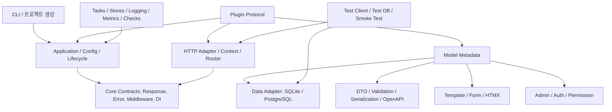

# Nim 풀스택 웹 프레임워크 구현 계획

상태: 진행 전  
작성일: 2026-08-04  
기준 문서: [풀스택 Nim 웹 프레임워크 기능 요구사항](nim-fullstack-framework-requirements.md)

> 체크박스 규칙: `[ ]` 미착수, `[-]` 진행 중, `[x]` 완료. 항목을 완료하려면 구현·테스트·문서를 함께 반영한다.

## 진행 기록

### 2026-08-04 — P0 기반 수직 슬라이스 1차

- [x] Nim manifest와 public package entry point를 추가했다.
- [x] `Request`, `Response`, `Handler`, `Middleware`, `Route` 핵심 계약을 추가했다.
- [x] exact route와 `:namedParameter` route를 구현했다.
- [x] global/route middleware composition과 startup/shutdown hook을 구현했다.
- [x] 환경변수 기반 개발 설정(`MAHANAIM_ENV`, `MAHANAIM_DEBUG`, `MAHANAIM_HOST`, `MAHANAIM_PORT`)을 구현했다.
- [x] `tests/test_core.nim`에 core contract test 7개를 작성했고 모두 통과했다.
- [x] CLI `check`/`dev`를 컴파일하고 실행 검증했다.
- [ ] 실제 Prologue HTTP adapter, JSON/TOML 설정, CI는 다음 작업으로 남아 있다.

### 2026-08-04 — P0 기반 수직 슬라이스 2차

- [x] 표준 async HTTP network adapter를 추가하고 core `Request`/`Response`와 연결했다.
- [x] loopback HTTP smoke test로 실제 TCP 요청과 응답을 검증했다.
- [x] `new NAME [PATH]` 프로젝트 생성 CLI를 추가했다.
- [x] 생성 프로젝트의 파일 구성과 기존 파일 덮어쓰기 방지를 테스트했다.
- [ ] Prologue 전용 adapter, typed extraction, JSON/TOML 설정, CI는 남아 있다.

### 2026-08-04 — P0 API 검증 1차

- [x] 명시적 `FieldSpec` schema와 path/query/header/body 입력 위치를 추가했다.
- [x] 문자열·정수 coercion, 기본값, 길이·범위 제약, 다중 오류 수집을 구현했다.
- [x] `application/problem+json` 응답과 field-level 오류 envelope을 추가했다.
- [x] API 검증·오류 응답 테스트 3개를 추가했고 전체 테스트가 통과했다.
- [ ] macro 기반 schema 생성과 일반 응답 타입별 content negotiation은 남아 있다.

### 2026-08-04 — P0 API 검증 2차

- [x] JSON object body의 named field extraction과 scalar coercion을 추가했다.
- [x] malformed JSON body를 body 위치의 `invalid_json` 오류로 보고한다.
- [x] `Accept` 헤더에 따른 problem JSON/text 응답 선택을 추가했다.
- [x] JSON body와 content negotiation 테스트 3개를 추가했고 전체 테스트가 통과했다.
- [ ] stream/SSE/WebSocket representation의 통합 content negotiation은 남아 있다.

### 2026-08-04 — P0 HTTP 응답 정책 1차

- [x] JSON response constructor와 `Set-Cookie` helper를 core contract에 추가했다.
- [x] HTML/JSON/text representation 선택과 미지원 media type의 406 응답을 구현했다.
- [x] representation 선택과 cookie 보안 속성 테스트를 추가했다.

### 2026-08-04 — P0 실행 경계 1차

- [x] `SyncHandler`와 `asyncHandler` adapter를 추가했다.
- [x] `getSync`/`postSync` 명시 등록 API를 추가했다.
- [x] sync handler가 공통 async dispatcher에서 동작하는 contract test를 추가했다.
- [ ] blocking I/O thread-pool offload와 실행 경계 진단은 남아 있다.

### 2026-08-04 — P0 설정 provider 1차

- [x] `.env`, JSON, TOML flat key/value, process environment provider를 추가했다.
- [x] provider 병합 순서를 정의하고 process environment가 최종 우선하도록 했다.
- [x] secret store와 `redactSecrets`를 추가해 로그·오류 출력 전 비밀값 치환을 지원한다.
- [x] 설정 병합·TOML secrets section·redaction 테스트 2개를 추가했다.
- [ ] 완전한 TOML 문법, JSON/TOML schema validation, CI 재현 설치는 남아 있다.

### 2026-08-04 — P0 application extension 1차

- [x] application-level custom error handler와 안전한 기본 500 handler를 추가했다.
- [x] plugin registration API를 추가하고 plugin이 route를 등록하는 contract test를 추가했다.
- [x] 예외 상세가 기본 응답에 노출되지 않는지 검증했다.
- [ ] plugin manifest, DI provider, command/admin extension point와 redacted error logging은 남아 있다.

### 2026-08-04 — P0 보안 기본값 1차

- [x] secure response headers를 기본 middleware로 적용했다.
- [x] 설정된 allowed host 검증과 400 거부 응답을 추가했다.
- [x] route·404·405 fallback에도 동일 보안 middleware가 적용되도록 dispatcher를 정리했다.
- [x] middleware closure composition 자기 재귀 회귀를 수정하고 보안 회귀 테스트를 추가했다.
- [ ] clickjacking 세부 정책, rate limit, timeout policy는 남아 있다.

### 2026-08-04 — P0 보안 기본값 2차

- [x] exact-origin CORS allow list와 response headers를 추가했다.
- [x] CORS preflight `OPTIONS` 204 응답을 추가했다.
- [x] request body size limit과 413 응답을 추가했다.
- [x] CORS 허용·거부·preflight·oversized body 회귀 테스트를 추가했다.
- [ ] 기본 활성화 정책, session binding, rate limit, timeout policy는 남아 있다.

### 2026-08-04 — P0 보안 기본값 3차

- [x] HMAC-SHA256 signed CSRF token과 보안 난수 nonce 생성을 추가했다.
- [x] safe method 응답의 CSRF cookie 발급과 변경 method의 cookie/header 검증을 추가했다.
- [x] constant-time signature 비교와 위조·누락 토큰 회귀 테스트를 추가했다.
- [ ] 기본 활성화 정책, session binding, signed auth cookie와 rate limit은 남아 있다.

### 2026-08-04 — P0 라우팅 기반 1차

- [x] route name registry와 중복 이름 검증을 추가했다.
- [x] typed parameter(`int`, `uint`, `float`, `bool`)와 trailing wildcard를 추가했다.
- [x] route group prefix·middleware와 named URL builder를 추가했다.
- [x] 정적 경로 우선순위와 동일 path의 HTTP method dispatch 회귀를 고정했다.
- [ ] radix/tree 기반 매칭 최적화, wildcard 인코딩 정책, Prologue adapter 연동은 남아 있다.

### 2026-08-04 — P0 pre-flight check 1차

- [x] config·route·security를 공통 `CheckReport` 계약으로 검사하도록 추가했다.
- [x] CLI `check`와 `dev`가 동일한 검사 결과를 사용하고 오류 시 non-zero로 종료하도록 변경했다.
- [x] 정상 설정과 invalid port·중복 route·약한 CSRF secret 실패 회귀 테스트를 추가했다.
- [ ] model·migration 검사와 CI/deployment 환경의 동일한 실행 wiring은 남아 있다.

검증 명령:

```powershell
nimble test
nimble verify
nimble check
```

## 1. 문서 목적

이 문서는 요구사항을 구현 가능한 작업 단위로 분해하고, 각 작업의 우선순위와 선행 조건을 정의한다. 목표는 Prologue의 저마법(low-magic) 사용 경험을 유지하면서 서버 렌더링 앱, 타입 안전 API, HTML/API 혼합형 앱을 하나의 애플리케이션 모델로 지원하는 것이다.

현재 저장소에는 요구사항 문서만 있으므로, 아래 계획은 신규 구현을 위한 기준선이다. “지원한다”는 표현은 단순 API 표면이 아니라 예제 앱, 자동화된 테스트, 문서가 함께 존재한다는 의미로 사용한다.

## 2. 우선순위 기준

우선순위는 다음 순서로 결정한다.

1. **P0 — 기반/차단 해소**: 이후 모든 기능이 의존하며, 잘못 설계하면 재작성 비용이 큰 계약
2. **P1 — 첫 번째 사용 가능한 제품**: CRUD 서버 앱과 타입 안전 API를 실제로 만들 수 있게 하는 필수 기능
3. **P2 — 운영 가능성과 확장성**: 보안 강화, 비동기 작업, 관측성, 플러그인 생태계
4. **P3 — 선택적 확장**: 핵심 프레임워크의 독립성을 해치지 않는 공식 패키지

판정 원칙은 **의존성 → 보안/데이터 손실 위험 → 사용자 가치 → 구현 규모** 순이다. 각 단계는 전 단계의 테스트와 문서가 통과된 뒤 시작한다.

## 3. 목표 아키텍처



### 핵심 설계 원칙

- [ ] **계약 우선**: `Request`, `Response`, `Handler`, `Middleware`, `Plugin`, `ModelMetadata`, `Storage`를 먼저 정의하고 구현체는 adapter로 둔다.
- [ ] **단일 메타데이터 원천**: 모델 메타데이터가 validation, serialization, form, admin, OpenAPI에 재사용되도록 한다. 기능별로 같은 필드를 중복 선언하지 않는다.
- [ ] **명시적 실행 경계**: sync handler, async handler, blocking 작업, background task의 경계를 타입·문서·진단으로 드러낸다.
- [ ] **안전한 기본값**: 비밀값 비노출, HTML escaping, CSRF, secure cookie, request size/timeout 제한을 기본값으로 둔다.
- [ ] **Prologue 비종속 코어**: Prologue는 초기 HTTP adapter와 호환 계층으로 활용하되, 핵심 도메인 계약이 Prologue 내부 API에 종속되지 않도록 한다.
- [ ] **기능마다 세 가지 산출물**: 구현 코드, 회귀 테스트, 사용자 문서를 하나의 작업으로 취급한다.

## 4. 단계별 로드맵

### Phase 0 — 기반선과 수직 슬라이스 (P0)

목표는 `new`로 생성한 앱이 설정을 읽고, 하나의 HTML route와 JSON route를 테스트·실행할 수 있게 하는 것이다.

- [ ] Nim 버전, 컴파일 옵션, 의존성 버전, 공개 API 안정성 정책을 manifest에 고정한다.
- [ ] `Application`, `Config`, `RequestContext`, `Response`, `Handler`, `Middleware`, `Error` 계약을 정의한다.
- [ ] Prologue adapter를 격리하고 method/path/query/header/cookie/body를 공통 context로 변환한다.
- [ ] router, route name/URL building, global·route middleware, lifecycle, error handler를 구현한다.
- [ ] CLI의 `new`, `dev`, `test`, `check`를 먼저 제공하고, 최소 예제 앱을 CI에서 실행한다.

완료 기준:

- [ ] HTML·JSON·upload·WebSocket route를 같은 앱에서 실행한다.
- [ ] 테스트 client가 동일한 handler를 호출한다.

### Phase 1 — 타입 안전 HTTP/API 기반 (P0/P1)

- [ ] path/query/header/body 선언에서 변환, 기본값, 제약, 오류 위치를 도출한다.
- [ ] request DTO와 response DTO를 분리하고 rename, partial update, nested object, 민감 필드 제외를 지원한다.
- [ ] JSON을 기본으로 구현하고 MessagePack을 동일 serializer 계약의 adapter로 추가한다.
- [ ] 날짜·시간, UUID, enum, 파일 등 공통 타입 serializer와 validation error envelope을 정의한다.
- [ ] route 선언에서 OpenAPI 3 schema를 만들고 Swagger UI와 ReDoc을 제공한다.
- [ ] pagination, filtering, sorting, field selection을 공통 query component로 제공한다.

완료 기준:

- [ ] route 선언만으로 검증과 구조화 오류가 생성된다.
- [ ] OpenAPI schema와 interactive 문서가 생성된다.

### Phase 2 — 모델 메타데이터와 데이터 계층 (P1)

- [ ] 선언적 Nim 모델과 field/index/constraint/관계 metadata를 정의한다.
- [ ] SQLite adapter를 먼저 완성하고 PostgreSQL adapter를 동일 계약으로 추가한다.
- [ ] query builder/QuerySet, 조건식, 정렬, pagination, aggregate, annotate, eager/lazy loading을 구현한다.
- [ ] migration 생성·검토·실행·롤백·상태 확인, fixture/seed, `db` CLI 명령을 제공한다.
- [ ] transaction/savepoint, connection pool, request 단위 DB session을 구현하고 locking은 backend capability로 명시한다.
- [ ] 모델 metadata를 API, form, admin과 연결한다. raw SQL은 명시적인 escape hatch로 둔다.

완료 기준:

- [ ] SQLite/PostgreSQL CRUD가 동작한다.
- [ ] 관계 query와 migration up/down 테스트가 통과한다.
- [ ] transaction isolation 테스트가 통과한다.

### Phase 3 — 서버 렌더링, 폼, 인증, 관리자 (P1)

- [ ] 안전한 기본 escaping, inheritance, include/partial, filter/tag/helper를 갖춘 template engine을 adapter 경계 뒤에 둔다.
- [ ] 모델/DTO에서 form, widget, model form, formset을 생성하고 field/form 오류를 표준화한다.
- [ ] CSRF token과 form validation을 서버 렌더링 흐름에 통합한다.
- [ ] 모델 등록만으로 CRUD admin을 생성하고 검색, 필터, 정렬, pagination, bulk action, inline, read-only field, custom layout을 추가한다.
- [ ] 세션 인증과 token/JWT API 인증을 같은 auth contract로 제공한다.
- [ ] 사용자·그룹·role·permission·route guard·object-level authorization, password 관리, session rotation을 구현한다.
- [ ] admin의 권한 검사와 audit log를 별도로 보장한다.

완료 기준:

- [ ] 별도 SPA 없이 CRUD 화면을 생성·검증할 수 있다.
- [ ] 권한 없는 admin/API 접근이 일관되게 거부된다.

### Phase 4 — 운영·확장·검증 (P2)

- [ ] static/upload와 local/S3 호환 storage, memory/Redis cache store를 adapter로 제공한다.
- [ ] request lifecycle과 분리된 background task 및 외부 queue contract를 제공한다.
- [ ] 구조화 logging, request ID, health/readiness, metrics, OpenTelemetry hook을 추가한다.
- [ ] system check와 운영 배포 점검을 CLI에 통합한다.
- [ ] WebSocket/SSE 테스트, live-server smoke test, test database와 transaction isolation 도구를 완성한다.
- [ ] plugin protocol로 route, DI, middleware, command, metadata, admin view, serializer, storage, auth backend를 확장한다.
- [ ] 보안 회귀 테스트와 HTTPS deployment checklist를 공개한다.

완료 기준:

- [ ] custom plugin이 route·command·admin을 추가한다.
- [ ] plugin 통합 테스트가 통과한다.
- [ ] 운영 점검이 배포 전 문제를 발견한다.

### Phase 5 — 생태계와 선택 기능 (P2/P3)

- [ ] class-based controller, function handler, application/request/task DI scope를 추가한다.
- [ ] 선택한 기본 template engine과 다른 엔진을 연결하는 adapter를 제공한다.
- [ ] Redis/Valkey/file/memory store 및 외부 ORM 연동 패턴을 문서화한다.
- [ ] OpenAPI 기반 TypeScript 또는 언어 중립 client artifact를 생성한다.
- [ ] WebSocket channel/group broadcast, Redis-backed channel layer, compression, ETag, response cache를 추가한다.
- [ ] Docker multi-stage, reverse proxy, systemd/컨테이너 배포와 graceful shutdown 예제를 제공한다.
- [ ] Geo/GIS, multi-tenant, CMS, frontend adapter, distributed scheduler, search, presence, GraphQL은 별도 패키지로 검토한다.

## 5. 요구사항별 구현 계획과 우선순위

### 애플리케이션 기반과 CLI

| 상태 | ID | 우선순위 | 구현 계획 |
| --- | --- | --- | --- |
| [-] | NFR-APP-001 | P0 | `new`가 재현 가능한 앱/모듈 구조와 환경별 설정 파일을 생성하도록 CLI를 설계한다. |
| [-] | NFR-APP-002 | P0 | `.env`와 JSON/TOML provider를 통합하고 secret 타입·redaction logger로 로그·오류·빌드 노출을 차단한다. |
| [-] | NFR-APP-003 | P0 | lifecycle registry, 명시적 error handler, middleware chain, plugin registration API를 코어 계약으로 정의한다. |
| [-] | NFR-APP-004 | P1 | `dev`, `db migrate`, `admin create-user`, `static collect`, `test`, `openapi`, `check` subcommand를 단계별로 추가한다. |
| [-] | NFR-APP-005 | P0 | Nim/프레임워크 버전과 checksum을 manifest/lockfile에 기록하고 CI에서 재현 설치를 검증한다. |

### HTTP·라우팅·응답

| 상태 | ID | 우선순위 | 구현 계획 |
| --- | --- | --- | --- |
| [-] | REQ-HTTP-001 | P0 | Prologue request를 공통 context로 변환하고 typed extractor를 method별로 구현한다. |
| [-] | REQ-HTTP-002 | P0 | route tree와 route name registry를 만들고 typed parameter, wildcard, group, URL builder, route middleware를 제공한다. |
| [ ] | REQ-HTTP-003 | P1 | response enum/trait를 HTML, text, JSON, file, redirect, stream, SSE, WebSocket adapter로 확장한다. |
| [x] | REQ-HTTP-004 | P0 | content negotiation과 `application/problem+json` 오류 envelope을 표준 response policy로 만든다. |
| [-] | REQ-HTTP-005 | P0 | sync/async handler 실행기를 분리하고 blocking 감지·thread-pool 전환 규칙을 문서와 check 명령에 반영한다. |

### 타입·검증·API

| 상태 | ID | 우선순위 | 구현 계획 |
| --- | --- | --- | --- |
| [x] | REQ-API-001 | P0 | Nim macro 또는 명시 schema로 입력 위치별 extractor, coercion, default, constraint, error path를 생성한다. |
| [ ] | REQ-API-002 | P1 | DTO projection/serialization policy를 모델 metadata와 분리해 rename, patch, nested, sensitive exclusion을 지원한다. |
| [ ] | REQ-API-003 | P1 | serializer protocol을 정의하고 JSON부터 MessagePack·날짜·UUID·enum·파일 adapter를 구현한다. |
| [ ] | REQ-API-004 | P1 | route/schema registry에서 OpenAPI 3를 생성하고 Swagger UI·ReDoc route를 붙인다. |
| [ ] | REQ-API-005 | P1 | 재사용 가능한 pagination/filter/sort/field-selection component와 공통 validation 오류 형식을 제공한다. |

### 데이터·ORM·마이그레이션

| 상태 | ID | 우선순위 | 구현 계획 |
| --- | --- | --- | --- |
| [ ] | REQ-DATA-001 | P0 | 모델 macro/metadata로 field, index, constraint, 관계를 선언하고 backend-neutral schema로 보관한다. |
| [ ] | REQ-DATA-002 | P1 | QuerySet/query builder AST와 backend compiler를 만들어 조건·정렬·집계·loading 전략을 표현한다. |
| [ ] | REQ-DATA-003 | P1 | schema diff, migration artifact, up/down/status/check와 fixture/seed 명령을 제공한다. |
| [ ] | REQ-DATA-004 | P1 | unit-of-work와 connection pool을 request context에 연결하고 savepoint·locking capability를 명시한다. |
| [ ] | REQ-DATA-005 | P1 | SQLite를 기준 backend로 완성한 뒤 PostgreSQL adapter와 backend capability matrix를 추가한다. |
| [ ] | REQ-DATA-006 | P0 | 모델 metadata를 validation/serializer/form/admin/OpenAPI가 읽는 공통 reflection 계약으로 만든다. |

### HTML·폼·관리자

| 상태 | ID | 우선순위 | 구현 계획 |
| --- | --- | --- | --- |
| [ ] | REQ-UI-001 | P1 | escaping을 기본 활성화한 template AST/renderer와 inheritance·partial·helper·i18n을 구현한다. |
| [ ] | REQ-UI-002 | P1 | form schema와 widget registry를 만들고 model form/formset, CSRF, 오류 표시를 renderer에 연결한다. |
| [ ] | REQ-ADMIN-001 | P1 | metadata에서 CRUD route·template·form을 생성하는 admin registry를 제공한다. |
| [ ] | REQ-ADMIN-002 | P2 | admin query/filter/action/layout registry로 검색·필터·inline·customization을 확장한다. |
| [ ] | REQ-ADMIN-003 | P1 | admin 전용 authorization policy와 immutable audit event 저장을 기본 제공한다. |
| [ ] | REQ-UI-003 | P1 | HTML partial response와 JSON response를 같은 route contract에서 선택하도록 하고 HTMX 예제를 제공한다. |

### 인증·보안

| 상태 | ID | 우선순위 | 구현 계획 |
| --- | --- | --- | --- |
| [ ] | REQ-SEC-001 | P1 | auth backend protocol 위에 session cookie와 JWT/token adapter를 구현한다. |
| [ ] | REQ-SEC-002 | P1 | permission evaluator, role/group, route guard, object policy를 composable policy로 제공한다. |
| [ ] | REQ-SEC-003 | P1 | Argon2/bcrypt 등 검증된 hashing adapter, reset token, rotation, login throttling hook을 제공한다. |
| [-] | REQ-SEC-004 | P0 | CSRF·CORS·clickjacking·CSP·allowed host·signed cookie·secret redaction을 secure-by-default middleware로 구성한다. |
| [ ] | REQ-SEC-005 | P1 | upload pipeline에서 size/MIME/extension/filename/path를 검증하고 저장소를 웹 루트와 분리한다. |
| [ ] | REQ-SEC-006 | P2 | rate limit·size·timeout·secure cookie 정책과 HTTPS 배포 점검을 기본 설정/CLI check로 제공한다. |

### 운영·확장·검증

| 상태 | ID | 우선순위 | 구현 계획 |
| --- | --- | --- | --- |
| [ ] | REQ-OPS-001 | P2 | storage/cache protocol과 local·S3·memory·Redis 구현체를 분리하고 오류/재시도 정책을 정의한다. |
| [ ] | REQ-OPS-002 | P2 | task contract와 queue adapter를 제공하며 응답 완료 후 enqueue, 재시도, idempotency를 문서화한다. |
| [ ] | REQ-OPS-003 | P2 | structured logger/request ID와 health/readiness/metrics/tracing instrumentation을 lifecycle에 연결한다. |
| [ ] | REQ-OPS-004 | P2 | email·flash·RSS/Atom·sitemap을 서버 렌더링용 독립 패키지로 제공한다. |
| [ ] | REQ-OPS-005 | P2 | locale/timezone context와 날짜·시간·숫자 formatter를 template/form/API에 공통 적용한다. |
| [ ] | REQ-EXT-001 | P2 | plugin manifest과 registration phase를 정의하고 route·DI·middleware·command·metadata·admin·serializer·storage·auth extension point를 제공한다. |
| [-] | REQ-TEST-001 | P0 | test client와 test app을 먼저 만들고 DB isolation, WebSocket/SSE, live-server smoke fixture를 단계별로 추가한다. |
| [-] | REQ-TEST-002 | P0 | config/route/model/migration/security check를 부팅 전 실행하고 CI와 배포 CLI에서 동일하게 사용한다. |
| [ ] | REQ-DOC-001 | P0 | 기능을 merge할 때 Nim 예제·API reference·migration/security guide·지원 버전 정책을 함께 갱신한다. |

## 6. SHOULD/MAY 우선순위

| 상태 | 우선순위 | 범위 | 구현 방침 |
| --- | --- | --- | --- |
| [ ] | P2 | class/function controller, DI scope, template adapter, store/ORM adapter pattern | 코어 계약이 안정된 뒤 API 호환성과 adapter 작성 경험을 검증한다. |
| [ ] | P2 | client artifact, channel broadcast, compression/ETag/cache, 배포 예제 | 운영·생태계 가치가 높으므로 Phase 4 후반부터 독립 패키지로 추가한다. |
| [ ] | P3 | Geo/GIS, multi-tenant, CMS, frontend adapter, scheduler, search, presence, GraphQL | 코어 의존성을 늘리지 않고 별도 패키지·별도 릴리스로 제공한다. |

## 7. 탄탄한 프레임워크를 위한 기초 다지기

### 7.1 첫 번째 수직 슬라이스

처음부터 모든 기능을 병렬 구현하지 않는다. 다음 예제 앱 하나를 기준으로 코어 계약을 검증한다.

- [ ] `new`로 생성한다.
- [ ] SQLite 모델과 migration을 만든다.
- [ ] 서버 렌더링 CRUD와 JSON CRUD를 같은 모델로 노출한다.
- [ ] validation 오류, CSRF, session login, admin 권한을 확인한다.
- [ ] OpenAPI 문서와 test client로 같은 route를 검증한다.
- [ ] health check, request ID, graceful shutdown을 확인한다.

이 수직 슬라이스가 통과하면 PostgreSQL, WebSocket/SSE, queue, 외부 storage를 추가한다. 이 순서로 진행해야 계층 간 계약이 실제 사용 흐름에서 검증된다.

### 7.2 품질 게이트

- [ ] 모든 public API는 최소 하나의 compile test와 runtime test를 가진다.
- [ ] 모든 보안 기본값은 성공 케이스보다 실패·우회 케이스를 먼저 테스트한다.
- [ ] migration은 빈 DB, 기존 데이터, rollback, 동시 요청 조건에서 검증한다.
- [ ] adapter는 공통 contract test suite를 공유한다. SQLite와 PostgreSQL 테스트가 같은 의미를 가져야 한다.
- [ ] benchmark는 HTTP, router, serialization, ORM query, template rendering으로 분리하고 버전별 결과를 기록한다.
- [ ] 문서 예제는 CI에서 컴파일·실행해 문서와 코드의 drift를 방지한다.

### 7.3 릴리스와 호환성 정책

- [ ] 코어 계약과 adapter API를 분리해 semantic versioning을 적용한다.
- [ ] 지원 Nim 버전, Prologue adapter 버전, SQLite/PostgreSQL 버전을 매 릴리스에 명시한다.
- [ ] deprecated API는 최소 한 주기 동안 경고를 내고 migration guide를 제공한다.
- [ ] 기능 성숙도는 `experimental`, `stable`, `deprecated`로 표시한다.
- [ ] 보안 수정은 별도 changelog와 영향 범위를 공개한다.

## 8. 초기 백로그

첫 구현 주기는 다음 순서로 시작한다.

- [-] **P0-01**: 저장소 구조, Nim manifest/lockfile, CI, 공개 API/버전 정책
- [x] **P0-02**: `Application`·`Config`·`RequestContext`·`Response`·오류 계약
- [-] **P0-03**: Prologue HTTP adapter, router, middleware, lifecycle
- [-] **P0-04**: `new/dev/test/check` CLI와 최소 HTML/JSON 예제
- [-] **P0-05**: test client, contract test, secret redaction, secure defaults
- [ ] **P1-01**: typed extraction, validation, DTO, JSON serialization
- [ ] **P1-02**: OpenAPI generator, Swagger UI, ReDoc
- [ ] **P1-03**: 모델 metadata와 SQLite CRUD/migration

각 항목은 구현·테스트·문서가 모두 완료되어야 Done으로 이동한다. P0 작업에서 API 계약이 바뀌면 후속 작업을 시작하기 전에 ADR(Architecture Decision Record)을 남긴다.

## 9. 주요 위험과 대응

| 위험 | 대응 |
| --- | --- |
| Prologue와 목표 기능 사이의 큰 격차 | Prologue adapter와 프레임워크 core를 분리하고, Prologue에 없는 ORM/template/admin은 신규 목표 기능으로 명시한다. |
| 모델 metadata가 지나치게 복잡해짐 | metadata의 최소 공통 집합부터 만들고 form/admin/OpenAPI를 contract test로 점진 연결한다. |
| Nim macro가 디버깅을 어렵게 함 | 생성 코드 확인 CLI, 명시 schema fallback, macro 경계의 작은 단위 테스트를 제공한다. |
| SQLite와 PostgreSQL 동작 차이 | backend capability를 명시하고 두 backend의 공통 contract test와 별도 compatibility test를 운영한다. |
| 보안 기능이 후순위로 밀림 | P0 secure defaults와 보안 회귀 테스트를 기반 단계에 포함하고, 기능 완료 조건에 보안 검사를 넣는다. |
| 기능 범위가 계속 커짐 | P3 기능은 공식 별도 패키지로 분리하고, 핵심 코어에는 adapter contract만 포함한다. |

## 10. 완료 판단

이 계획의 1차 목표는 “Django 기능 목록을 모두 복제”하는 것이 아니라, 다음 세 가지 사용 흐름을 안정적으로 제공하는 것이다.

- [ ] 개발자가 Nim 타입과 모델 하나로 서버 렌더링 CRUD를 만든다.
- [ ] 같은 모델에서 검증된 JSON API와 OpenAPI 문서를 얻는다.
- [ ] 애플리케이션이 테스트·보안 점검·관측성·플러그인 확장을 갖춘 상태로 운영된다.

이 기준을 충족한 뒤 SHOULD와 MAY 기능을 확장한다. 구현 중 외부 프레임워크의 현재 지원 기능이 바뀌면 요구사항 문서의 조사 기준일·버전·추적성 메모를 함께 갱신한다.
